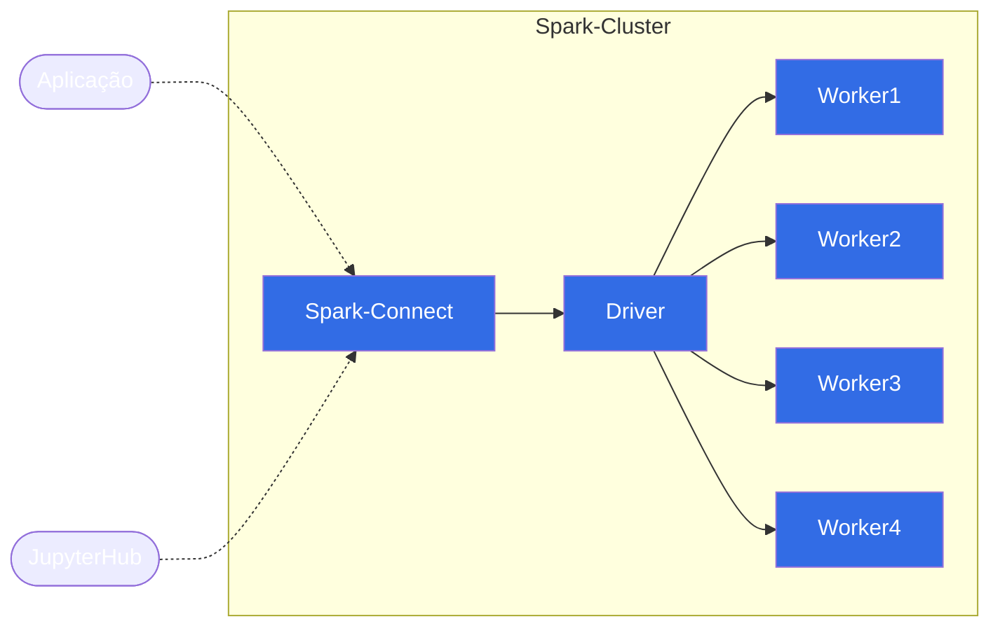

# Spark Connect
*For english version [README](docs/README.en.md)* :sunglasses:

Esse projeto tem como intuito demonstrar a utilização do [Spark Connect](https://spark.apache.org/docs/latest/spark-connect-overview.html) introduzido na versão 3.4 do Spark, que possibilita que o Spark e seu ecossistema utilizados de qualquer lugar conectando aplicações, IDEs e Notebooks.


## Arquitetura do Spark Connect


### Funcionamento

O client do Spark Connect traduz as operações feitas nos Dataframes em Query Plans que são codificados utilizando protocol buffers, que são enviados ao servidor utilizando o framework gRPC.[*](https://spark.apache.org/docs/latest/spark-connect-overview.html)


## Arquitetura do Cluster Docker do projeto



## Requisitos
- [Docker e Docker Compose](https://docs.docker.com/engine/install/)
- [Python 3.10+](https://www.python.org/downloads/release/python-31010/)
- [Poetry](https://python-poetry.org/docs/) 

## Instruções de uso
### Iniciar o cluster local Spark

```bash
docker compose up --build
```

### Executando o codigo de exemplo

- Instalar as dependencias do projeto com o Poetry
```bash
poetry install
```

- Ativar o ambiente virtual
```bash
poetry shell
```

- Executar o script
```bash
python src/read_sample.py
```

- Caso tudo funcione haverá uma nova pasta `rendimentos` e um novo arquivo `rendimentos-schema.json` dentro da pasta `data`.
