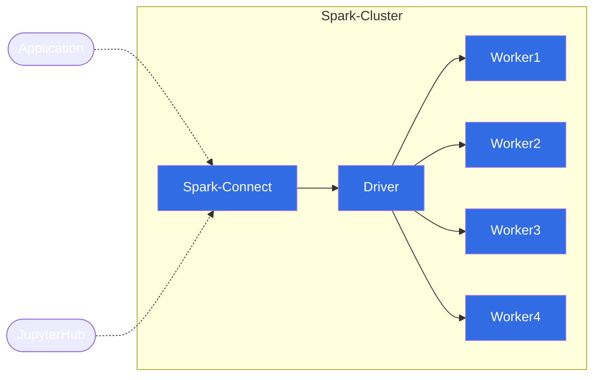

# Spark Connect
*Para a versão em português [README](../README.md)* :sunglasses:

This project aims to demonstrate the use of [Spark Connect](https://spark.apache.org/docs/latest/spark-connect-overview.html) included in version 3.4 of Spark, which enables Spark and its ecosystem to be used from anywhere by connecting applications, IDEs and Notebooks.

## Spark Connect Architecture


### How it works

The Spark Connect client translates DataFrame operations into unresolved logical query plans which are encoded using protocol buffers and sent to the server using the gRPC framework.[*](https://spark.apache.org/docs/latest/spark-connect-overview.html)


### Project Docker cluster architecture




## Requirements

- [Docker and Docker Compose](https://docs.docker.com/engine/install/)
- [Python 3.10+](https://www.python.org/downloads/release/python-31010/)
- [Poetry](https://python-poetry.org/docs/) 

## How to run

### Start Spark local cluster

```bash
docker compose up --build
```

### Running the sample code


- In the project folder install the dependencies with Poetry
```bash
poetry install
```

- Activating the virtual environment
```bash
poetry shell
```

- Running the script
```bash
python src/read_sample.py
```

- If everithing worked there will be a new folder `rendimentos` and a new file `rendimentos-schema.json` inside the `data` folder.